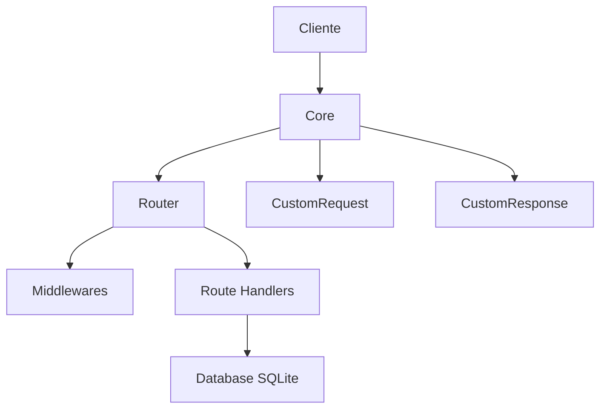

# LMS - Mini-Framework HTTP

[](https://nodejs.org/)
[](https://www.typescriptlang.org/)
[](https://www.sqlite.org/)

Um mini-framework HTTP construído do zero em **Node.js puro** (sem Express/Fastify), utilizando **TypeScript** e **SQLite nativo**.

> **Estudo baseado no curso [Node.js](https://www.origamid.com/curso/node-js) da [Origamid](https://www.origamid.com/)**

---

## Visão Geral

Este projeto é um estudo prático desenvolvido durante o curso de Node.js da Origamid. O objetivo é entender como frameworks HTTP funcionam por baixo dos panos, construindo cada peça manualmente:

- Servidor HTTP nativo
- Sistema de rotas com parâmetros dinâmicos
- Middlewares (globais e por rota)
- Request/Response customizados
- Tratamento de erros centralizado
- Banco de dados SQLite integrado

---

## Arquitetura



### Fluxo de uma Requisição

1. **Cliente** envia requisição HTTP
2. **Core** recebe e transforma em `CustomRequest` / `CustomResponse`
3. **Middlewares globais** são executados (ex: `bodyJson`, `logger`)
4. **Router** encontra a rota correspondente (suporta parâmetros dinâmicos)
5. **Middlewares da rota** são executados
6. **Handler** processa a requisição e retorna resposta
7. Em caso de erro, `RouteError` centraliza o tratamento

---

## Evolução por Commits (Aprendizados)

| Commit | Aula | Conceitos Aprendidos |
|--------|------|---------------------|
| `ea0022a` | Setup | Estrutura inicial do projeto Node.js com TypeScript |
| `3378dab` | Aula 1 | `createServer` do módulo `node:http` - servidor HTTP básico |
| `1ed5554` | Aula 2/3 | SQLite nativo com `node:sqlite`, PRAGMAs de otimização, tabelas relacionais com foreign keys |
| `6f77d8f` | Aula 4 | Handlers e manipulação de requisições/respostas |
| `fdec889` | Aula 5 | Sistema de rotas com registro de métodos HTTP (GET, POST, PUT, DELETE, HEAD) |
| `cd86a83` | - | Custom Request/Response com interface fluente (`res.status(200).json(data)`) |
| `1f04bfd` | - | Organização da estrutura de pastas (`core/`, `http/`, `middleware/`, `utils/`) |
| `54eef35` | - | Rotas dinâmicas com parâmetros (`:id`, `:slug`) e algoritmo de matching |
| `a1f41eb` | - | Sistema de middlewares (globais via `router.use()` e por rota) |
| `e29d10f` | - | Tratamento de erros centralizado com classe `RouteError` e respostas `application/problem+json` |

---

## Componentes Principais

### Core (`core/core.ts`)

Classe principal que orquestra o servidor, router e middlewares. Responsável por:
- Criar o servidor HTTP
- Processar requisições através do handler
- Executar middlewares globais e de rota
- Tratar erros de forma centralizada

```typescript
const core = new Core();
core.router.use([logger]);
core.router.get('/course/:course', handler);
core.init();
```

### Router (`core/router.ts`)

Sistema de rotas com:
- Registro de rotas por método HTTP
- Suporte a parâmetros dinâmicos (`:param`)
- Middlewares por rota
- Algoritmo de matching que compara segmentos da URL

```typescript
core.router.get('/user/:id', handler, [authMiddleware]);
core.router.post('/user', createHandler);
```

### CustomRequest (`core/http/custom-request.ts`)

Extensão de `IncomingMessage` com propriedades extras:
- `pathname`: caminho da URL
- `query`: parâmetros de query string (`URLSearchParams`)
- `params`: parâmetros da rota dinâmica
- `body`: corpo da requisição parseado

### CustomResponse (`core/http/custom-response.ts`)

Extensão de `ServerResponse` com interface fluente:
- `status(code)`: define o status code e retorna `this`
- `json(data)`: serializa e envia JSON

```typescript
res.status(200).json({ message: 'OK' });
```

### Middlewares (`core/middleware/`)

#### bodyJson
Parseia automaticamente o corpo de requisições com `Content-Type: application/json`.

#### logger
Loga requisições no formato: `[DD/MM/YYYY, HH:MM:SS] METHOD /path`

### RouteError (`core/utils/route-error.ts`)

Classe de erro customizada para tratamento centralizado:

```typescript
throw new RouteError('Not found', 404);
```

Respostas de erro seguem o padrão `application/problem+json`:
```json
{
  "status": 404,
  "title": "Not found"
}
```

### Database (`core/database.ts`)

Camada de acesso ao SQLite nativo (`node:sqlite`) com:
- PRAGMAs de otimização (foreign keys, journal mode, cache)
- Tabelas: `cursos` e `aulas` (relacionadas)
- Funções CRUD: `criarCurso`, `criarAula`, `pegarCursos`, `pegarCurso`, `pegarAulas`, `pegarAula`

---

## Estrutura de Pastas

```
LMS/
├── core/
│   ├── core.ts              # Classe principal do servidor
│   ├── router.ts            # Sistema de rotas
│   ├── database.ts          # Camada de banco de dados
│   ├── http/
│   │   ├── custom-request.ts   # Request customizado
│   │   └── custom-response.ts  # Response customizado
│   ├── middleware/
│   │   ├── body-json.ts     # Middleware de parse JSON
│   │   └── logger.ts        # Middleware de logging
│   └── utils/
│       └── route-error.ts   # Classe de erro customizada
├── index.ts                 # Entry point do servidor
├── client.mjs               # Cliente de teste
├── lms.sqlite               # Banco de dados SQLite
└── package.json
```

---

## Como Executar

### Pré-requisitos
- Node.js 22+ (para suporte a `node:sqlite` nativo)

### Instalação
```bash
npm install
```

### Servidor (com hot-reload)
```bash
npm run start
```

### Cliente de teste
```bash
npm run client
```

---

## Tecnologias

- **Node.js 22+** (módulos nativos: `http`, `sqlite`)
- **TypeScript**
- **SQLite** (banco de dados embarcado)

---

## Créditos

Este projeto foi desenvolvido como estudo prático durante o curso **[Node.js](https://www.origamid.com/curso/back-end-node-js)** da **[Origamid](https://www.origamid.com/)**.

A Origamid é uma plataforma brasileira de cursos de desenvolvimento web com foco em qualidade e didática.

---

## Licença

ISC

