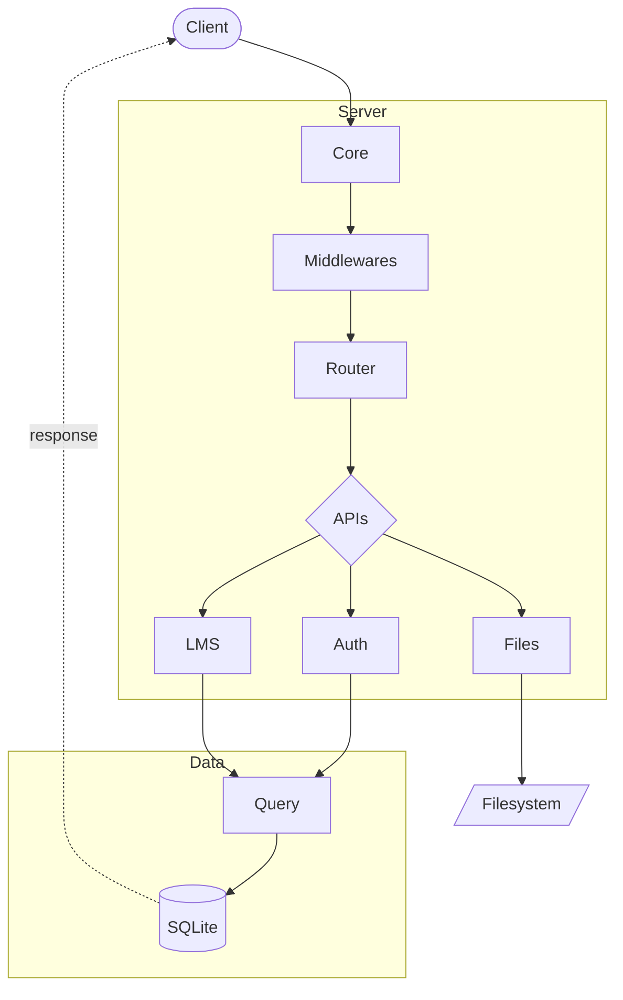

# LMS - Mini HTTP Framework

[](./README.md)
[](./README.pt-br.md)

[](https://nodejs.org/)
[](https://www.typescriptlang.org/)
[](https://www.sqlite.org/)
[](https://www.docker.com/)

A mini HTTP framework built from scratch using **pure Node.js** (no Express/Fastify), with **TypeScript** and **native SQLite**.

> **Study project based on the Node.js course from [Origamid](https://www.origamid.com/curso/node-js)**

---

## Overview

This project is a hands-on study developed during the Origamid Node.js course. The goal is to understand how HTTP frameworks work under the hood by building each piece manually:

- Native HTTP server
- Route system with dynamic parameters
- Middlewares (global and per-route)
- Custom Request/Response
- Centralized error handling
- Integrated SQLite database
- API system with abstract classes (CoreProvider, Api)
- Session-based authentication system
- File upload with streaming (public/private)
- Data validation
- Full CRUD for courses and lessons
- PDF certificate generation
- User search with pagination
- Email/password update via frontend
- User/course/lesson deletion with confirmation
- Email system (Resend) for password reset
- Docker + Caddy deployment (automatic HTTPS)

---

## Architecture



### Request Flow

1. **Client** sends HTTP request
2. **Core** receives and transforms into `CustomRequest` / `CustomResponse`
3. **Global middlewares** are executed (e.g., `bodyJson`, `logger`)
4. **Router** finds the matching route (supports dynamic parameters)
5. **Auth middleware** validates user session (when required)
6. **Route middlewares** are executed
7. **Handler** processes the request and returns response
8. On error, `RouteError` centralizes handling

## Folder Structure

```
LMS/
├── api/
│   ├── auth/
│   │   ├── index.ts            # Authentication API
│   │   ├── mail/
│   │   │   └── mail.ts         # Email service (Resend)
│   │   ├── middleware/
│   │   │   └── auth.ts         # Auth middleware (guard, optional)
│   │   ├── query.ts            # Auth queries
│   │   ├── services/
│   │   │   └── session.ts      # Session service
│   │   ├── tables.ts           # Auth table definitions
│   │   └── utils/
│   │       ├── password.ts     # Password hash utilities
│   │       └── utils.ts        # General auth utilities
│   ├── files/
│   │   ├── index.ts            # File upload API (public/private)
│   │   └── utils.ts            # Utilities (mimeTypes, ETag, LimitBytes)
│   └── lms/
│       ├── index.ts            # Main LMS API
│       ├── query.ts            # LMS queries
│       ├── tables.ts           # LMS table definitions
│       └── utils/
│           └── certificate.ts  # PDF certificate generation
├── front/
│   ├── favicon.svg             # Application icon
│   ├── index.html              # Application frontend
│   ├── script.js               # Frontend logic (SPA routing)
│   └── style.css               # Styles
├── core/
│   ├── core.ts                 # Main server class
│   ├── router.ts               # Route system
│   ├── database.ts             # Database layer
│   ├── http/
│   │   ├── custom-request.ts   # Custom request
│   │   └── custom-response.ts  # Custom response
│   ├── middleware/
│   │   ├── body-json.ts        # JSON parse middleware
│   │   └── logger.ts           # Logging middleware
│   └── utils/
│       ├── abstract.ts         # Abstract classes CoreProvider and Api
│       ├── format-data.ts      # Date formatting utility
│       ├── parse-cookies.ts    # Cookie parsing utility
│       ├── route-error.ts      # Custom error class
│       └── validate.ts         # Data validation utility
├── db/                         # SQLite database (Docker volume)
├── files/
│   ├── public/                 # Public uploads (free lessons)
│   └── private/                # Private uploads (paid lessons)
├── seed/
│   ├── init-db.ts              # Database initialization
│   ├── seed-courses.ts         # Script to seed courses and lessons
│   └── seed-users.ts           # Script to seed test users
├── secrets/
│   ├── email_key.txt           # Resend API key
│   └── pepper.txt              # Pepper for password hashing
├── index.ts                    # Server entry point
├── env.ts                      # Environment variables
├── client.mjs                  # Test client
├── entrypoint.sh               # Docker initialization script
├── Caddyfile                   # Caddy reverse proxy config
├── Dockerfile                  # Docker image (dev/prod targets)
├── compose.yaml                # Docker Compose (production)
├── compose.override.yaml       # Docker Compose (development)
└── package.json
```

---

## Getting Started

### Prerequisites

- Node.js 22+ (for native `node:sqlite` support)
- Docker & Docker Compose (for containerized deployment)

### Local Development (without Docker)

```bash
# Install dependencies
npm install

# Start server (with hot-reload)
npm run start

# Test client (optional)
npm run client
```

### Docker Development

Uses `compose.override.yaml` for hot-reload with mounted volumes.

```bash
# Create secrets files
mkdir -p secrets
echo "test" > secrets/email_key.txt
echo "secret" > secrets/pepper.txt

# Start containers
docker compose up -d --build

# View logs (see hot-reload in action)
docker compose logs -f node

# Seed database (first time - automatic via entrypoint)
docker compose exec node npm run seed
```

> **Note:** If you add new dependencies, run `docker compose up -d --build` to rebuild.

### Docker Production

Uses `compose.yaml` with Caddy for HTTPS (auto SSL via Let's Encrypt).

```bash
# Create .env file
cat > .env << EOF
ACME_EMAIL=your@email.com
SERVER_NAME=yourdomain.com
FROM_EMAIL=noreply@yourdomain.com
FILES_PATH=/files
DB_PATH=/db/lms.sqlite
EOF

# Create secrets
mkdir -p secrets
echo "your_resend_api_key" > secrets/email_key.txt
echo "your_secret_pepper" > secrets/pepper.txt

# Build and start
docker compose up -d --build
```

### Default Credentials (after seed)

| User | Email | Password |
|------|-------|----------|
| Admin | `admin@admin.com` | `Admin123456` |
| User | `fpanizio10@gmail.com` | `Aa123456789` |

---

## Technologies

- **Node.js 22+** (native modules: `http`, `sqlite`)
- **TypeScript**
- **SQLite** (embedded database)
- **jsPDF** (certificate generation)
- **Docker** (containerization)
- **Caddy** (reverse proxy, automatic HTTPS)
- **Resend** (email sending)

---

## Credits

This project was developed as a hands-on study during the **[Node.js](https://www.origamid.com/curso/back-end-node-js)** course from **[Origamid](https://www.origamid.com/)**.

Origamid is a Brazilian web development course platform focused on quality and didactics.

---

## License

ISC
