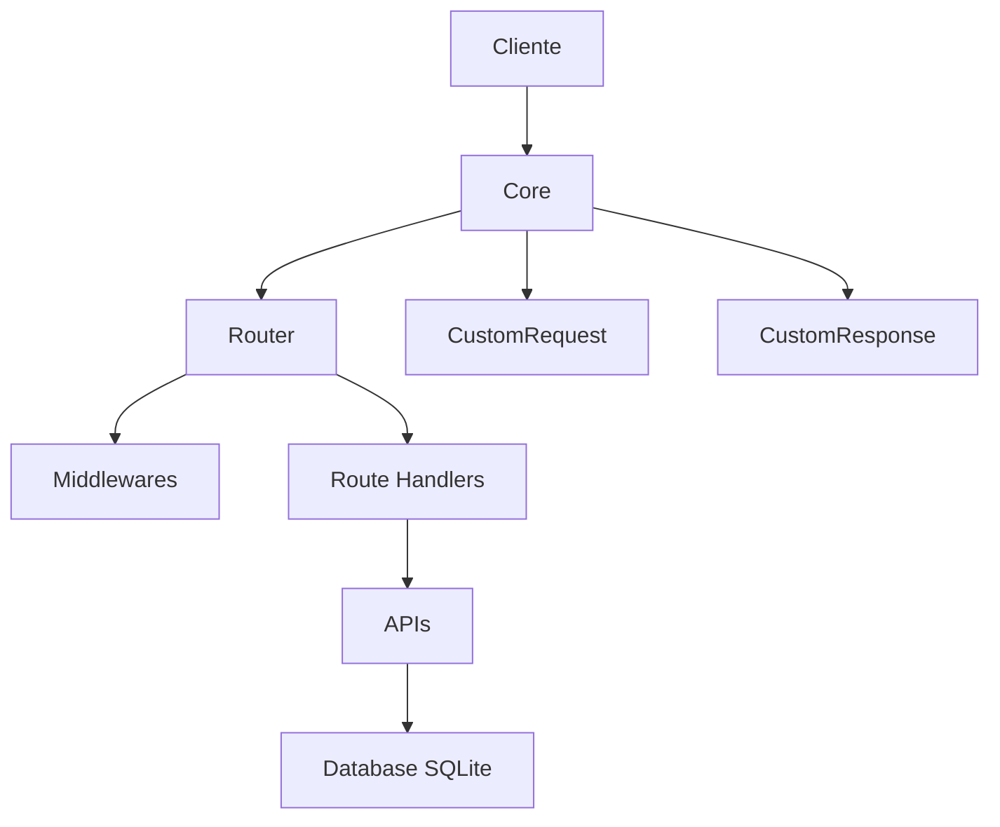

# LMS - Mini-Framework HTTP

[](https://nodejs.org/)
[](https://www.typescriptlang.org/)
[](https://www.sqlite.org/)

Um mini-framework HTTP construído do zero em **Node.js puro** (sem Express/Fastify), utilizando **TypeScript** e **SQLite nativo**.

> **Estudo baseado no curso [Node.js](https://www.origamid.com/curso/node-js) da [Origamid](https://www.origamid.com/)**

---

## Visão Geral

Este projeto é um estudo prático desenvolvido durante o curso de Node.js da Origamid. O objetivo é entender como frameworks HTTP funcionam por baixo dos panos, construindo cada peça manualmente:

- Servidor HTTP nativo
- Sistema de rotas com parâmetros dinâmicos
- Middlewares (globais e por rota)
- Request/Response customizados
- Tratamento de erros centralizado
- Banco de dados SQLite integrado
- Sistema de APIs com classes abstratas (CoreProvider, Api)

---

## Arquitetura



### Fluxo de uma Requisição

1. **Cliente** envia requisição HTTP
2. **Core** recebe e transforma em `CustomRequest` / `CustomResponse`
3. **Middlewares globais** são executados (ex: `bodyJson`, `logger`)
4. **Router** encontra a rota correspondente (suporta parâmetros dinâmicos)
5. **Middlewares da rota** são executados
6. **Handler** processa a requisição e retorna resposta
7. Em caso de erro, `RouteError` centraliza o tratamento

## Estrutura de Pastas

```
LMS/
├── api/
│   ├── auth/
│   │   ├── index.ts            # API de autenticação
│   │   ├── query.ts            # Queries de autenticação
│   │   └── tables.ts           # Definição de tabelas de auth
│   └── lms/
│       ├── index.ts            # API principal do LMS
│       ├── query.ts            # Queries do LMS
│       └── tables.ts           # Definição de tabelas do LMS
├── core/
│   ├── core.ts                 # Classe principal do servidor
│   ├── router.ts               # Sistema de rotas
│   ├── database.ts             # Camada de banco de dados
│   ├── http/
│   │   ├── custom-request.ts   # Request customizado
│   │   └── custom-response.ts  # Response customizado
│   ├── middleware/
│   │   ├── body-json.ts        # Middleware de parse JSON
│   │   └── logger.ts           # Middleware de logging
│   └── utils/
│       ├── abstract.ts         # Classes abstratas CoreProvider e Api
│       ├── format-data.ts      # Utilitário de formatação de datas
│       └── route-error.ts      # Classe de erro customizada
├── index.ts                    # Entry point do servidor
├── client.mjs                  # Cliente de teste
├── lms.sqlite                  # Banco de dados SQLite
└── package.json
```

---

## Como Executar

### Pré-requisitos
- Node.js 22+ (para suporte a `node:sqlite` nativo)

### Instalação
```bash
npm install
```

### Servidor (com hot-reload)
```bash
npm run start
```

### Cliente de teste
```bash
npm run client
```

---

## Tecnologias

- **Node.js 22+** (módulos nativos: `http`, `sqlite`)
- **TypeScript**
- **SQLite** (banco de dados embarcado)

---

## Créditos

Este projeto foi desenvolvido como estudo prático durante o curso **[Node.js](https://www.origamid.com/curso/back-end-node-js)** da **[Origamid](https://www.origamid.com/)**.

A Origamid é uma plataforma brasileira de cursos de desenvolvimento web com foco em qualidade e didática.

---

## Licença

ISC

