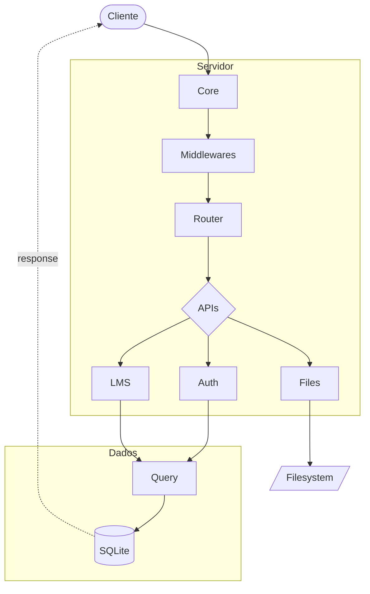

# LMS - Mini-Framework HTTP

[](./README.md)
[](./README.pt-br.md)

[](https://nodejs.org/)
[](https://www.typescriptlang.org/)
[](https://www.sqlite.org/)
[](https://www.docker.com/)

Um mini-framework HTTP construído do zero em **Node.js puro** (sem Express/Fastify), utilizando **TypeScript** e **SQLite nativo**.

> **Estudo baseado no curso Node.js da [Origamid](https://www.origamid.com/curso/node-js)**

---

## Visão Geral

Este projeto é um estudo prático desenvolvido durante o curso de Node.js da Origamid. O objetivo é entender como frameworks HTTP funcionam por baixo dos panos, construindo cada peça manualmente:

- Servidor HTTP nativo
- Sistema de rotas com parâmetros dinâmicos
- Middlewares (globais e por rota)
- Request/Response customizados
- Tratamento de erros centralizado
- Banco de dados SQLite integrado
- Sistema de APIs com classes abstratas (CoreProvider, Api)
- Sistema de autenticação com sessões
- Upload de arquivos com streaming (público/privado)
- Validação de dados
- CRUD completo de cursos e aulas
- Geração de certificados em PDF
- Busca de usuários com paginação
- Atualização de email/senha via frontend
- Exclusão de usuários/cursos/aulas com confirmação
- Sistema de email (Resend) para reset de senha
- Deploy com Docker + Caddy (HTTPS automático)

---

## Arquitetura



### Fluxo de uma Requisição

1. **Cliente** envia requisição HTTP
2. **Core** recebe e transforma em `CustomRequest` / `CustomResponse`
3. **Middlewares globais** são executados (ex: `bodyJson`, `logger`)
4. **Router** encontra a rota correspondente (suporta parâmetros dinâmicos)
5. **Middleware de autenticação** valida sessão do usuário (quando necessário)
6. **Middlewares da rota** são executados
7. **Handler** processa a requisição e retorna resposta
8. Em caso de erro, `RouteError` centraliza o tratamento

## Estrutura de Pastas

```
LMS/
├── api/
│   ├── auth/
│   │   ├── index.ts            # API de autenticação
│   │   ├── mail/
│   │   │   └── mail.ts         # Serviço de email (Resend)
│   │   ├── middleware/
│   │   │   └── auth.ts         # Middleware de autenticação (guard, optional)
│   │   ├── query.ts            # Queries de autenticação
│   │   ├── services/
│   │   │   └── session.ts      # Serviço de sessão
│   │   ├── tables.ts           # Definição de tabelas de auth
│   │   └── utils/
│   │       ├── password.ts     # Utilitários de hash de senha
│   │       └── utils.ts        # Utilitários gerais de auth
│   ├── files/
│   │   ├── index.ts            # API de upload de arquivos (público/privado)
│   │   └── utils.ts            # Utilitários (mimeTypes, ETag, LimitBytes)
│   └── lms/
│       ├── index.ts            # API principal do LMS
│       ├── query.ts            # Queries do LMS
│       ├── tables.ts           # Definição de tabelas do LMS
│       └── utils/
│           └── certificate.ts  # Geração de certificados em PDF
├── front/
│   ├── favicon.svg             # Ícone da aplicação
│   ├── index.html              # Frontend da aplicação
│   ├── script.js               # Lógica do frontend (SPA routing)
│   └── style.css               # Estilos
├── core/
│   ├── core.ts                 # Classe principal do servidor
│   ├── router.ts               # Sistema de rotas
│   ├── database.ts             # Camada de banco de dados
│   ├── http/
│   │   ├── custom-request.ts   # Request customizado
│   │   └── custom-response.ts  # Response customizado
│   ├── middleware/
│   │   ├── body-json.ts        # Middleware de parse JSON
│   │   └── logger.ts           # Middleware de logging
│   └── utils/
│       ├── abstract.ts         # Classes abstratas CoreProvider e Api
│       ├── format-data.ts      # Utilitário de formatação de datas
│       ├── parse-cookies.ts    # Utilitário de parse de cookies
│       ├── route-error.ts      # Classe de erro customizada
│       └── validate.ts         # Utilitário de validação de dados
├── db/                         # Banco de dados SQLite (volume Docker)
├── files/
│   ├── public/                 # Uploads públicos (aulas gratuitas)
│   └── private/                # Uploads privados (aulas pagas)
├── seed/
│   ├── init-db.ts              # Inicialização do banco de dados
│   ├── seed-courses.ts         # Script para popular cursos e aulas
│   └── seed-users.ts           # Script para popular usuários de teste
├── secrets/
│   ├── email_key.txt           # API key do Resend
│   └── pepper.txt              # Pepper para hash de senhas
├── index.ts                    # Entry point do servidor
├── env.ts                      # Variáveis de ambiente
├── client.mjs                  # Cliente de teste
├── entrypoint.sh               # Script de inicialização Docker
├── Caddyfile                   # Configuração do Caddy (reverse proxy)
├── Dockerfile                  # Imagem Docker (targets dev/prod)
├── compose.yaml                # Docker Compose (produção)
├── compose.override.yaml       # Docker Compose (desenvolvimento)
└── package.json
```

---

## Como Executar

### Pré-requisitos

- Node.js 22+ (para suporte a `node:sqlite` nativo)
- Docker & Docker Compose (para deploy containerizado)

### Desenvolvimento Local (sem Docker)

```bash
# Instalar dependências
npm install

# Iniciar servidor (com hot-reload)
npm run start

# Cliente de teste (opcional)
npm run client
```

### Desenvolvimento com Docker

Usa `compose.override.yaml` para hot-reload com volumes montados.

```bash
# Criar arquivos de secrets
mkdir -p secrets
echo "test" > secrets/email_key.txt
echo "segredo" > secrets/pepper.txt

# Iniciar containers
docker compose up -d --build

# Ver logs (acompanhar hot-reload)
docker compose logs -f node

# Popular banco (primeira vez - automático via entrypoint)
docker compose exec node npm run seed
```

> **Nota:** Se adicionar novas dependências, execute `docker compose up -d --build` para rebuild.

### Produção com Docker

Usa `compose.yaml` com Caddy para HTTPS automático (Let's Encrypt).

```bash
# Criar arquivo .env
cat > .env << EOF
ACME_EMAIL=seu@email.com
SERVER_NAME=seudominio.com
FROM_EMAIL=noreply@seudominio.com
FILES_PATH=/files
DB_PATH=/db/lms.sqlite
EOF

# Criar secrets
mkdir -p secrets
echo "sua_api_key_resend" > secrets/email_key.txt
echo "sua_pepper_secreta" > secrets/pepper.txt

# Build e iniciar
docker compose up -d --build
```

### Credenciais Padrão (após seed)

| Usuário | Email | Senha |
|---------|-------|-------|
| Admin | `admin@admin.com` | `Admin123456` |
| User | `fpanizio10@gmail.com` | `Aa123456789` |

---

## Tecnologias

- **Node.js 22+** (módulos nativos: `http`, `sqlite`)
- **TypeScript**
- **SQLite** (banco de dados embarcado)
- **jsPDF** (geração de certificados)
- **Docker** (containerização)
- **Caddy** (reverse proxy, HTTPS automático)
- **Resend** (envio de emails)

---

## Créditos

Este projeto foi desenvolvido como estudo prático durante o curso **[Node.js](https://www.origamid.com/curso/back-end-node-js)** da **[Origamid](https://www.origamid.com/)**.

A Origamid é uma plataforma brasileira de cursos de desenvolvimento web com foco em qualidade e didática.

---

## Licença

ISC
